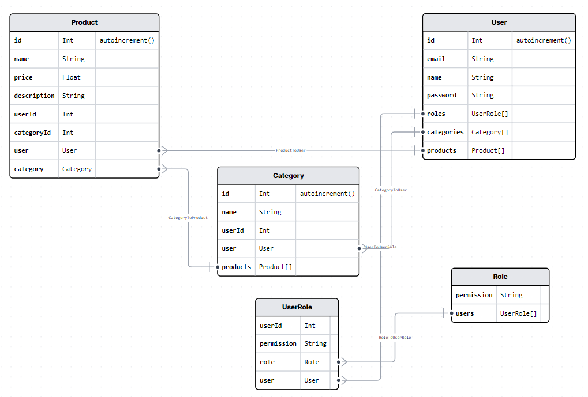

# Store API

## Database schema



## How to run

- clone the repo
- cd into the repo

```bash
$ cd Store-API
```

- install dependencies

```bash
$ yarn
```

- create a .env file like the .env.example file

- create sqlite database 

```bash 
$ npx prisma db push --force-reset
```

- seed roles and admin user

```bash
$ npx prisma db seed
```

- run the server

```bash
$ yarn dev
```

## Postman collection

[](https://api.postman.com/collections/25854021-94efd612-963a-4bf9-a743-4ba72bdcae3c?access_key=PMAT-01HMEJF8DJXJS526PGPKYBAMV3)


